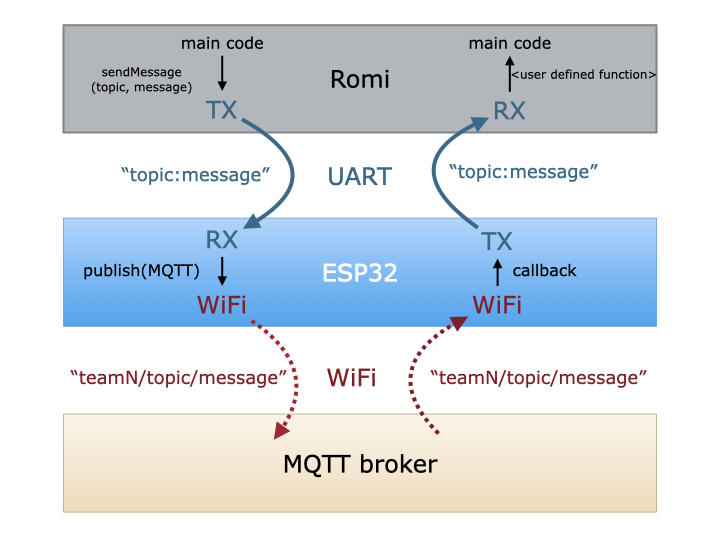

# mqtt

An Arduino wrapper for [PubSubClient](https://pubsubclient.knolleary.net) that manages connectivity. The wrapper functions make use of non-blocking connection checking. 

To use the library, you will need to create a file, `wifi_credentials.h`, that declares:

* WiFi credentials:

    ```
    const char* ssid = "<your ssid>";
    const char* password = "<your network password>";
    ```

* MQTT credentials:

    ```
    const char* mqtt_server = "<mqtt-server-name>";
    #define mqtt_port <mqtt port>
    #define MQTT_USER "<username>"
    #define MQTT_PASSWORD "<password>"
    ```

The `wifi_credentials.h` file can live wherever you want, so long as it can be found by the compiler. If you put it in the `src` folder of your project, be sure to add it to your `.gitignore` file. Better is to put it in a local directory on your machine and point to it using `lib_extra_dirs`. **You will need to edit `platformio.ini` in the example(s) to point to the correct directory.**

The examples demonstrate the workflow shown below. Call `sendMessage(topic, message)` from a Romi/Leonardo to send a message. The example code for the ESP32 will prepend the team name to the topic. **See the readme files in the example folders for additional chip-specific information.**

The ESP32 example will subscribe to all messages that have the team number as the root topic and pass messages on to the Romi. It is up to the user to create a means of handling messages received.

If your Romi/Leonardo is running at 5V (the default), **you must use a level shifter to drop the voltage from the `TX` on the Romi to the `RX` on the ESP32.** See the readme's in the specific examples for more information.


