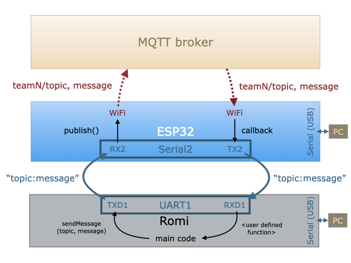

# MQTT

An Arduino wrapper for [PubSubClient](https://pubsubclient.knolleary.net) that manages MQTT connectivity. The wrapper functions make use of non-blocking connection checking. 

To use the library, you will need to create a file, `wifi_credentials.h`, that declares:

```//---- WiFi settings
const char* ssid = "WPI-Open";
const char* password = "";

//---- HiveMQ Cloud Broker settings
const char* mqtt_server = "....s1.eu.hivemq.cloud";    // from your HiveMQ account
const char* mqtt_username = "";                        // from your HiveMQ account
const char* mqtt_password = "";                        // from your HiveMQ account
const int mqtt_port = 8883;

// HiveMQ Cloud Let's Encrypt CA certificate
static const char *root_ca PROGMEM = R"EOF(
-----BEGIN CERTIFICATE-----
MIIFazCCA1OgAwIBAgIRAIIQz7DSQONZRGPgu2OCiwAwDQYJKoZIhvcNAQELBQAw
TzELMAkGA1UEBhMCVVMxKTAnBgNVBAoTIEludGVybmV0IFNlY3VyaXR5IFJlc2Vh
cmNoIEdyb3VwMRUwEwYDVQQDEwxJU1JHIFJvb3QgWDEwHhcNMTUwNjA0MTEwNDM4
WhcNMzUwNjA0MTEwNDM4WjBPMQswCQYDVQQGEwJVUzEpMCcGA1UEChMgSW50ZXJu
ZXQgU2VjdXJpdHkgUmVzZWFyY2ggR3JvdXAxFTATBgNVBAMTDElTUkcgUm9vdCBY
MTCCAiIwDQYJKoZIhvcNAQEBBQADggIPADCCAgoCggIBAK3oJHP0FDfzm54rVygc
h77ct984kIxuPOZXoHj3dcKi/vVqbvYATyjb3miGbESTtrFj/RQSa78f0uoxmyF+
0TM8ukj13Xnfs7j/EvEhmkvBioZxaUpmZmyPfjxwv60pIgbz5MDmgK7iS4+3mX6U
A5/TR5d8mUgjU+g4rk8Kb4Mu0UlXjIB0ttov0DiNewNwIRt18jA8+o+u3dpjq+sW
T8KOEUt+zwvo/7V3LvSye0rgTBIlDHCNAymg4VMk7BPZ7hm/ELNKjD+Jo2FR3qyH
B5T0Y3HsLuJvW5iB4YlcNHlsdu87kGJ55tukmi8mxdAQ4Q7e2RCOFvu396j3x+UC
B5iPNgiV5+I3lg02dZ77DnKxHZu8A/lJBdiB3QW0KtZB6awBdpUKD9jf1b0SHzUv
KBds0pjBqAlkd25HN7rOrFleaJ1/ctaJxQZBKT5ZPt0m9STJEadao0xAH0ahmbWn
OlFuhjuefXKnEgV4We0+UXgVCwOPjdAvBbI+e0ocS3MFEvzG6uBQE3xDk3SzynTn
jh8BCNAw1FtxNrQHusEwMFxIt4I7mKZ9YIqioymCzLq9gwQbooMDQaHWBfEbwrbw
qHyGO0aoSCqI3Haadr8faqU9GY/rOPNk3sgrDQoo//fb4hVC1CLQJ13hef4Y53CI
rU7m2Ys6xt0nUW7/vGT1M0NPAgMBAAGjQjBAMA4GA1UdDwEB/wQEAwIBBjAPBgNV
HRMBAf8EBTADAQH/MB0GA1UdDgQWBBR5tFnme7bl5AFzgAiIyBpY9umbbjANBgkq
hkiG9w0BAQsFAAOCAgEAVR9YqbyyqFDQDLHYGmkgJykIrGF1XIpu+ILlaS/V9lZL
ubhzEFnTIZd+50xx+7LSYK05qAvqFyFWhfFQDlnrzuBZ6brJFe+GnY+EgPbk6ZGQ
3BebYhtF8GaV0nxvwuo77x/Py9auJ/GpsMiu/X1+mvoiBOv/2X/qkSsisRcOj/KK
NFtY2PwByVS5uCbMiogziUwthDyC3+6WVwW6LLv3xLfHTjuCvjHIInNzktHCgKQ5
ORAzI4JMPJ+GslWYHb4phowim57iaztXOoJwTdwJx4nLCgdNbOhdjsnvzqvHu7Ur
TkXWStAmzOVyyghqpZXjFaH3pO3JLF+l+/+sKAIuvtd7u+Nxe5AW0wdeRlN8NwdC
jNPElpzVmbUq4JUagEiuTDkHzsxHpFKVK7q4+63SM1N95R1NbdWhscdCb+ZAJzVc
oyi3B43njTOQ5yOf+1CceWxG1bQVs5ZufpsMljq4Ui0/1lvh+wjChP4kqKOJ2qxq
4RgqsahDYVvTH9w7jXbyLeiNdd8XM2w9U/t7y0Ff/9yi0GE44Za4rF2LN9d11TPA
mRGunUHBcnWEvgJBQl9nJEiU0Zsnvgc/ubhPgXRR4Xq37Z0j4r7g1SgEEzwxA57d
emyPxgcYxn/eR44/KJ4EBs+lVDR3veyJm+kXQ99b21/+jh5Xos1AnX5iItreGCc=
-----END CERTIFICATE-----
)EOF";
```
The `wifi_credentials.h` file can live wherever you want, so long as it can be found by the compiler. If you put it in the `src` folder of your project, be sure to add it to your `.gitignore` file. Better is to put it in a local directory on your machine and point to it using `lib_extra_dirs`. **You will need to edit `platformio.ini` in the example(s) to point to the correct directory.**

The examples demonstrate the workflow shown below. Call `sendMessage(topic, message)` from a Romi/Leonardo to send a message. The example code for the ESP32 will prepend the team name to the topic. **See the readme files in the example folders for additional chip-specific information.**

The ESP32 example will subscribe to all messages that have the team number as the root topic and pass messages on to the Romi. It is up to the user to create a means of handling messages received.

If your Romi/Leonardo is running at 5V (the default), **you must use a level shifter to drop the voltage from the `TX` on the Romi to the `RX` on the ESP32.** See the readme's in the specific examples for more information.


